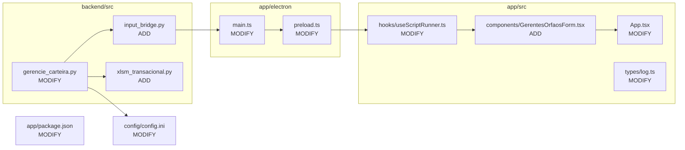
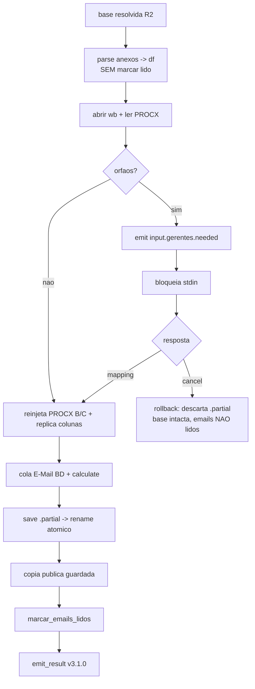

# Implementation Plan: Captura de Gerentes Órfãos em Runtime + Rollback Transacional

**Contexto:** Hoje CNPJs sem cadastro de gerente geram `#N/D` na coluna de verificação; o app avisa e abre o executável DIRECIONA para preenchimento manual posterior. Esta feature resolve os gerentes órfãos ANTES de colar, via formulário em runtime, reinjeta no `PROCX GERENTES`, elimina o DIRECIONA e adiciona confirmação de fechamento com rollback transacional do `.xlsm`.
**Tech Stack:** Python 3 (xlwings COM, pywin32, pandas, BeautifulSoup) · Electron 33 (main/preload) · React 18 + Vite 5 + TypeScript · protocolo JSON Lines (stdout) + novo canal stdin (request/response).

---

## 1. Objetivos & Escopo

* **In:** E-mails não lidos do Serasa (Outlook COM), sheet `PROCX GERENTES` (config), e o mapeamento CNPJ→gerente digitado pelo usuário no formulário em runtime.
* **Out:** `PROCX GERENTES` reinjetada (B=gerente, C=CNPJ, demais colunas replicadas) e `E-Mail BD` colada sem `#N/D`; planilha diária + cópia pública salvas atomicamente; v3.1.0.
* **Constraint (R2 — invariante de ordem):** `encontrar_arquivo_base_excel()` permanece ANTES de `extrair_dados_dos_anexos()` em `main()`. Não reordenar.
* **Constraint (R5):** o input dos órfãos ocorre ANTES de marcar e-mails lidos; a marcação `UnRead=False` é movida para DEPOIS do `wb.save()` bem-sucedido (reduz, não amplia, a janela de perda conhecida).
* **Constraint (R1):** todo output Python→UI passa por `emit()`/`emit_result()`; o request de input também é um evento JSON Lines. Nenhum `print()` solto.
* **Constraint (R3):** arquivos permanecem `.xlsm`; `app.calculate()` forçado antes de ler colunas calculadas.
* **Constraint (R4 — rollback híbrido):** base nunca sobrescrita (zero-copy); escrita em `.partial` + rename atômico só após save OK; supervisor (Electron) varre `.partial` órfãos. Planilha antiga só removida após a nova existir.
* **Constraint (R6/R7/R8):** SemVer MINOR (3.0.1→3.1.0, fonte única `app/package.json`); tudo em pt-BR; `BASE_FILENAME_PATTERN` mantido em sincronia se tocado (não será tocado).

---

## 2. Design Tecnico

### Diagrama de Impacto



### Fluxo de Dados

1. **Resolver base (inalterado):** `encontrar_arquivo_base_excel()` antes de qualquer extração (R2).
2. **Parse sem marcar lido:** `extrair_dados_dos_anexos()` passa a SÓ parsear → `df`; a marcação `UnRead=False` sai do loop e vira `marcar_emails_lidos(emails)` chamada no fim (R5).
3. **Abrir workbook (sessão xlwings única):** abre a base; lê `PROCX GERENTES` (sheet/colunas do config) → `mapa = {cnpj: gerente}`.
4. **Detectar órfãos:** lista de CNPJs do `df` (dedupe) menos os presentes no `mapa` → `orfaos`.
5. **Se `orfaos` ≠ ∅:** `input_bridge.request_input()` emite evento `input.gerentes.needed` (JSON Lines, com `orfaos:[{cnpj,razao_social}]`) e BLOQUEIA em `sys.stdin.readline()`.
6. **UI:** `useScriptRunner` detecta o step, renderiza `GerentesOrfaosForm`; confirmar só habilita com todos os campos preenchidos; envia mapping via IPC `script:provideInput`; `main.ts` escreve `JSON\n` no `child.stdin`.
7. **Reinjeção PROCX:** acrescenta linhas (B=gerente, C=CNPJ); para cada coluna usada ≠ B/C, replica a fórmula/valor da linha anterior (mesma técnica do VLOOKUP atual). `app.calculate()`.
8. **Colagem E-Mail BD:** insere `df` como hoje + copia fórmula da coluna de verificação. `app.calculate()`; verifica `#N/D` (não deve restar). DIRECIONA removido.
9. **Save atômico:** `wb.save(<final>.partial)` → `os.replace()` para o nome final só após sucesso. Cópia pública idem (salva `.partial`, remove antigas, rename). 
10. **Pós-save:** `marcar_emails_lidos(emails)` → `emit_result()`.
11. **Fechamento em runtime:** `main.ts` intercepta `close`; se `activeChild` ativo → dialog SIM/NÃO. SIM → cancel cooperativo via stdin → (timeout) `kill` → varredura de `.partial`/`.bak` órfãos (idempotente, também no boot) → quit.

### Estruturas de Dados (Draft)

```
# Evento de request (Python → UI), via emit():
{ level:"step", step:"input.gerentes.needed",
  data:{ orfaos:[ {cnpj:"...", razao_social:"..."} ] } }

# Resposta (UI → Python), 1 linha JSON no stdin:
{ "mapping": { "<cnpj>": "<gerente>" } }          # confirmação
{ "cancel": true }                                 # fechamento/cancelamento

# config.ini [Excel] (novas chaves):
sheet_procx        = PROCX GERENTES
col_procx_gerente  = B
col_procx_cnpj     = C
# (planilha_dados = E-Mail BD  → mantido; nome confirmado)

# input_bridge.request_input(step, payload) -> dict
#   emite evento + readline(stdin) + json.loads; sentinela cancel -> raise CancelExecucao

# xlsm_transacional: salvar_atomico(wb, destino) | sweep_orfaos(pasta) | guard_publico(pasta, novo)
```

### Cronograma (Gantt)

```mermaid
gantt
  dateFormat X
  axisFormat %s
  section Backend
  Core: PROCX+orfaos+split parse/mark   :0, 3
  Reinjecao+colagem+atomic+DIRECIONA    :3, 3
  section Integracao
  Ponte stdin (py+electron+preload+hook):2, 2
  section UI
  Formulario orfaos + App + types       :4, 2
  section Infra/Testes
  Close-confirm+sweep+bump+docs+pytest  :6, 3
```



### Visão de Execução (Flowchart)



---

## 3. Execucao Faseada

### Fase 1: Núcleo de Detecção de Órfãos (Core Domain)
- [ ] **1.1: Separar parse de marcação-lida** [MODIFY: ./backend/src/gerencie_carteira.py]
    - Remover `email.UnRead=False` + emit `outlook.marked` de dentro do loop de `extrair_dados_dos_anexos()`; criar `marcar_emails_lidos(emails)` chamada após o save. Em `main()`, manter `encontrar_arquivo_base_excel()` antes da extração (R2) — não reordenar.
    - *Verificação:* pytest unitário confirma que `extrair_dados_dos_anexos()` não altera `UnRead`; `main()` ainda chama base antes de extrair.
- [ ] **1.2: Chaves de config das sheets** [MODIFY: ./config/config.ini]
    - Adicionar em `[Excel]`: `sheet_procx = PROCX GERENTES`, `col_procx_gerente = B`, `col_procx_cnpj = C`. Manter `planilha_dados = E-Mail BD`.
    - *Verificação:* `carregar_configuracoes()` valida as novas chaves como obrigatórias sem erro.
- [ ] **1.3: Leitura do PROCX + detecção de órfãos** [MODIFY: ./backend/src/gerencie_carteira.py]
    - Função `ler_mapa_procx(wb, cfg) -> dict`: lê sheet/colunas do config → `{cnpj:gerente}`; sheet vazia → mapa vazio. Função `detectar_orfaos(df, mapa) -> list`: CNPJs do df (dedupe) ausentes no mapa. `emit()` com contagem.
    - *Verificação:* pytest cobre mapa cheio/vazio, dedupe de CNPJ duplicado, e caso "nenhum órfão".

### Fase 2: Ponte de Input Bidirecional (Integration)
- [ ] **2.1: Bridge de input no Python** [ADD: ./backend/src/input_bridge.py]
    - `request_input(step, payload) -> dict`: emite evento via `emit()` (R1), bloqueia em `sys.stdin.readline()`, faz `json.loads`; sentinela `{"cancel":true}` levanta `CancelExecucao`. Linha não-parseável → erro tratado, sem corromper stream.
    - *Verificação:* pytest com stdin mockado: resposta válida retorna dict; sentinela levanta `CancelExecucao`.
- [ ] **2.2: stdin habilitado + handler no main** [MODIFY: ./app/electron/main.ts]
    - `spawn` stdio `["pipe","pipe","pipe"]`; IPC `script:provideInput` escreve `JSON+"\n"` em `activeChild.stdin`; helper para escrever o sentinela de cancelamento.
    - *Verificação:* `npm run build` (tsc) sem erros; execução dev: linha chega ao Python.
- [ ] **2.3: Superfície no preload + detecção no hook** [MODIFY: ./app/electron/preload.ts] [MODIFY: ./app/src/hooks/useScriptRunner.ts] [MODIFY: ./app/src/types/log.ts]
    - preload: `provideGerentesInput(mapping)` → `script:provideInput`. types: `OrfaoEntry`, estado `pendingInput`. hook: ao receber step `input.gerentes.needed`, popular `pendingInput`; ao submeter, chamar IPC e limpar.
    - *Verificação:* tsc ok; recebimento do evento popula estado (log dev).

### Fase 3: Formulário de Órfãos (UI)
- [ ] **3.1: Componente do formulário** [ADD: ./app/src/components/GerentesOrfaosForm.tsx]
    - Lista cada CNPJ órfão (+ razão social) com input de gerente; botão Confirmar desabilitado até todos preenchidos; emite mapping ao confirmar. Texto pt-BR.
    - *Verificação:* render manual: confirmar só habilita com todos os campos; mapping correto enviado.
- [ ] **3.2: Composição na App** [MODIFY: ./app/src/App.tsx]
    - Renderiza `GerentesOrfaosForm` (modal) quando `pendingInput` presente; some ao confirmar/cancelar.
    - *Verificação:* fluxo dev com órfão simulado mostra/oculta o form corretamente.

### Fase 4: Reinjeção, Colagem, DIRECIONA e Escrita Atômica (Core Domain)
- [ ] **4.1: Helper transacional do .xlsm** [ADD: ./backend/src/xlsm_transacional.py]
    - `salvar_atomico(wb, destino)` (save em `<destino>.partial` → `os.replace`); `guard_publico(pasta, novo)` (salva `.partial`, remove `Gerencie*.xls*` antigas só depois, rename); `sweep_orfaos(pasta)` idempotente. Falha ao preparar → aborta antes de qualquer escrita.
    - *Verificação:* pytest: falha simulada deixa base intacta e sem arquivo final; `sweep_orfaos` remove `.partial` e é idempotente.
- [ ] **4.2: Reinjeção PROCX + colagem E-Mail BD + remover DIRECIONA** [MODIFY: ./backend/src/gerencie_carteira.py]
    - Orquestrar (sessão xlwings única): ler PROCX → detectar órfãos → se houver, `input_bridge.request_input()` (R5, antes de marcar lido) → reinjetar B/C + replicar linha anterior nas demais colunas usadas → `app.calculate()` → colar `df` em `E-Mail BD` (lógica atual + cópia da fórmula de verificação) → `app.calculate()` → `salvar_atomico` + `guard_publico` → `marcar_emails_lidos`. Remover leitura de `executavel_direciona`, o `os.startfile(executavel)` e a chave no loop de `expandvars`. `#N/D` residual → warning (nunca abre nada).
    - *Verificação:* fluxo end-to-end manual sem órfão e com órfão; nenhum caminho chama `os.startfile`/DIRECIONA; `E-Mail BD` sem `#N/D`.
- [ ] **4.3: Remover DIRECIONA do config** [MODIFY: ./config/config.ini]
    - Remover `executavel_direciona = ...` e comentário associado.
    - *Verificação:* grep por `direciona` (case-insensitive) no repo retorna zero referências de código/config ativas.

### Fase 5: Fechamento Seguro, Recuperação, Versão e Testes (Infrastructure / Testing)
- [ ] **5.1: Confirmação de fechamento + sweep supervisor** [MODIFY: ./app/electron/main.ts]
    - Interceptar `close`/`before-quit`: se `activeChild` → dialog SIM/NÃO pt-BR ("o programa está em execução, deseja realmente fechar?"). SIM → enviar cancel cooperativo no stdin → timeout → `kill` → `sweep` de `.partial`/`.bak` órfãos (planilhas + pública); rodar o mesmo sweep no boot (`app.whenReady`). NÃO → cancela o fechamento.
    - *Verificação:* fechar durante runtime mostra o diálogo; SIM restaura estado (base intacta, sem `.partial`); base antiga nunca corrompida.
- [ ] **5.2: Bump SemVer + docs de contexto** [MODIFY: ./app/package.json] [MODIFY: ./context/timeline.md] [MODIFY: ./context/metaspec.md]
    - `npm version minor --no-git-tag-version` (3.1.0). Atualizar fase atual no timeline e estado/dívidas no metaspec (header: versão+data) conforme `AGENTS.md`.
    - *Verificação:* UI exibe v3.1.0 (IPC); Python loga v3.1.0; docs dentro dos limites de linha.
- [ ] **5.3: Suíte de testes** [ADD: ./backend/tests/test_gerentes_orfaos.py] [ADD: ./backend/tests/test_rollback_transacional.py] [ADD: ./backend/tests/test_input_bridge.py]
    - Cobrir: detecção de órfãos (cheio/vazio/dedupe/nenhum), split parse↔mark, save atômico + sweep idempotente, request/cancel via stdin mockado.
    - *Verificação:* `cd backend && python -m pytest` — todas as suítes (existentes + novas) passando.

---

## 4. Estrategia de Testes

- [ ] **Unitários:** detecção de órfãos (mapa cheio/vazio, CNPJ duplicado resolvido uma vez, lista vazia → sem form); split parse/marcação (`extrair_dados_dos_anexos` não toca `UnRead`); `salvar_atomico`/`sweep_orfaos` (falha deixa base intacta, sweep idempotente); `input_bridge` com stdin mockado (mapping vs sentinela cancel).
- [ ] **Integração (IPC):** dev run — evento `input.gerentes.needed` chega à UI; mapping volta pelo `child.stdin`; cancelamento cooperativo encerra sem corromper.
- [ ] **Manual/E2E (Outlook+Excel):** caminho sem órfão (form não aparece); com órfão (form bloqueia confirmar até preencher; PROCX reinjetada; `E-Mail BD` sem `#N/D`); fechamento em runtime (diálogo SIM/NÃO + rollback); regressão da cascata exit 4 inalterada.

---

## 5. Rollback & Riscos

- **Risco:** Kill forçado (TerminateProcess) durante o COM/save → handlers Python não executam.
    - *Mitigação:* recuperação no supervisor (Electron) — base nunca sobrescrita (zero-copy) + sweep idempotente de `.partial`/`.bak` no fechamento confirmado e no boot.
- **Risco:** Quebra da invariante de ordem (R2) ao mover a marcação de lidos.
    - *Mitigação:* base resolvida antes da extração permanece intacta; marcação só após save; teste unitário do split + nota explícita (invariante segue sem teste de integração — dívida conhecida não agravada).
- **Risco:** `wb.save()` falha após o usuário digitar os gerentes → dado digitado perdido.
    - *Mitigação:* emails permanecem não lidos (marcação só pós-save) → rerun re-solicita; `emit()` registra o mapping capturado no evento de erro para diagnóstico.
- **Risco:** Colisão de nome (rerun no mesmo dia: nome novo == base) no rename atômico.
    - *Mitigação:* detectar colisão e, só nesse caso raro, criar `.bak` da base antes do `os.replace` (custo pontual); fluxo normal continua zero-copy.
- **Risco:** `PROCX GERENTES` inexistente (não apenas vazia) → reinjeção impossível.
    - *Mitigação:* sheet ausente → `emit("error", step="excel.procx.missing")` + rollback + exit não-zero (não fabricar schema). Sheet existente porém vazia → escreve B/C sem replicar (sem linha anterior).
- **Risco:** Stream JSON Lines corrompido por novo canal stdin.
    - *Mitigação:* stdin é canal separado de leitura; request continua via `emit()` (R1); linha de resposta inválida → erro tratado, nunca `print()` solto.
- **Rollback:** Reverter = checkout da tag `v3.0.1` + rebuild (`build_core.ps1` + `npm run dist*`). Em runtime, abortar/fechar descarta `.partial` e mantém a base anterior intacta — estado idêntico a "não rodou".
