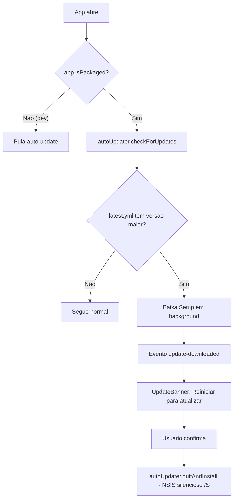
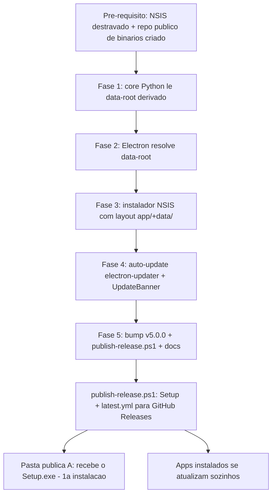

# Implementation Plan: Wizard NSIS + Auto-update via GitHub Releases

**Contexto:** Hoje o app é distribuído como pasta `./Aplicativo/` copiada à mão, com o workspace de dados fixo em `%USERPROFILE%\Documents\Gerencie_Carteira`. É preciso um instalador (wizard) que outras máquinas rodem, com layout de pastas editável, e um canal de atualização automática para não depender de redistribuição manual a cada versão.
**Tech Stack:** Electron 33 + React 18 + Vite 5 + TypeScript 5 · Python 3.x (PyInstaller `--onefile`) · electron-builder 25 (NSIS) · electron-updater · GitHub Releases (repo público separado de binários — estratégia B).

---

## 1. Objetivos & Escopo

* **In:** Build empacotado (NSIS `Setup.exe` + `latest.yml` + `.blockmap`); escolha de pasta-pai pelo usuário no wizard; releases publicadas no repo público de binários.
* **Out:** Instalador wizard distribuível; app instalado em `<pai>\Gerencie Carteira\app` com `data\` irmã; auto-update silencioso a partir do GitHub.
* **Constraint:** Estratégia B — código-fonte continua privado; **nenhum token embutido no app**. Só o repo de binários é público.
* **Constraint:** `config.ini` passa a ser 100% padrão — sem caminho de workspace por-máquina. Os paths locais são derivados da localização do executável em runtime.
* **Constraint:** Mudança incompatível (`config.ini` perde chaves + workspace muda de lugar + IPC novo) → **bump MAJOR v5.0.0** (regra de `AGENTS.md`).
* **Constraint:** Instalação per-user (sem admin) numa pasta gravável — o app precisa criar `data\` ao lado de si.
* **Constraint:** A pasta pública `A:\PUBLICA\GERENCIE CARTEIRA PÚBLICA` não muda — permanece fixa no `config.ini`.

### Mapa de Impacto

```
Gerencie_Carteira/
├── backend/src/
│   ├── directory_bootstrap.py          [MODIFY] resolve_data_root() ciente de frozen
│   └── gerencie_carteira.py            [MODIFY] config sem paths locais (derivados)
├── backend/tests/
│   └── test_directory_bootstrap.py     [MODIFY] testes da nova resolução
├── config/
│   └── config.ini                      [MODIFY] remove 3 chaves de path local
├── app/
│   ├── electron/
│   │   ├── main.ts                     [MODIFY] resolveDataRoot + autoUpdater + IPC
│   │   ├── preload.ts                  [MODIFY] API de update
│   │   └── installer.nsh               [ADD]    NSIS preInit ($INSTDIR padrão)
│   ├── src/
│   │   ├── App.tsx                     [MODIFY] monta <UpdateBanner/>
│   │   ├── components/UpdateBanner.tsx  [ADD]   UI de atualização
│   │   └── types/log.ts                [MODIFY] tipos de evento de update
│   └── package.json                    [MODIFY] electron-updater + publish + nsis + v5.0.0
├── publish-release.ps1                 [ADD]    build + publish GitHub Releases
├── .gitignore                          [MODIFY] ignora data/ de dev
├── AGENTS.md / README.md               [MODIFY] novo layout + fluxo de release
└── context/metaspec.md / timeline.md   [MODIFY] estado v5.0.0
```

---

## 2. Design Tecnico

### Layout em runtime (máquina do usuário)

```
<pasta-pai — padrão Documents, editável no wizard>\
└── Gerencie Carteira\
    ├── app\                ← $INSTDIR (NSIS instala aqui)
    │   ├── Gerencie Carteira.exe
    │   └── resources\
    │       ├── gerencie_carteira_core.exe
    │       └── config\config.ini      (extraResources — inalterado)
    └── data\               ← criada no 1º uso por ensure_workspace()
        ├── planilhas\
        ├── html\
        └── logs\
```

### Resolução do diretório de dados (fonte única de verdade)

A pasta `data\` é **irmã** de `$INSTDIR`. Python e Electron calculam o mesmo caminho de forma independente — acoplamento "manter em sincronia", igual ao `BASE_FILENAME_PATTERN` já existente.

* **Python (`directory_bootstrap.resolve_data_root`)**
    * frozen: `Path(sys.executable).parent.parent.parent / "data"` → `…\Gerencie Carteira\data` (`sys.executable` = `…\app\resources\core.exe`)
    * dev: `Path(__file__).parent.parent.parent / "data"` → `<repo>\data`
* **Electron (`main.ts → resolveDataRoot`)**
    * empacotado: `path.resolve(process.resourcesPath, "..", "..", "data")` (`resourcesPath` = `$INSTDIR\resources`)
    * dev: `path.resolve(__dirname, "..", "..", "data")` → `<repo>\data`

### Fluxo de Dados — config 100% padrão

1. **`config.ini` enxuto:** mantém só `pasta_copia_excel` (pública, fixa), `[Excel]` e `[Email]`. As chaves `pasta_destino_html`, `pasta_diario_excel`, `pasta_logs` são **removidas**.
2. **`carregar_configuracoes()`:** após `config.read`, calcula `data_root = resolve_data_root()` e injeta `config["Paths"]["pasta_destino_html|pasta_diario_excel|pasta_logs"]` com `data_root/{html,planilhas,logs}`. O restante do pipeline (que lê `config["Paths"][...]`) **não muda** — blast radius mínimo.
3. **`ensure_workspace()`:** cria `data_root/{planilhas,html,logs}` idempotentemente.
4. **`main.ts`:** `resolveLocalPlanilhasDir()` e `loadAllowedPathPrefixes()` deixam de parsear o `config.ini` para os paths locais e passam a derivar de `resolveDataRoot()`. `resolvePublicDir()` continua lendo `pasta_copia_excel` do `config.ini` (chave mantida).

### Fluxo de Auto-update (electron-updater)



* Feed = repo público `Capital-Financas-FIDC/Gerencie-Carteira-releases` → **sem token no runtime**.
* Comparação usa `app.getVersion()` (= `app/package.json`, fonte única) contra `latest.yml`.
* Erros do updater viram evento `level: warning` — **nunca derrubam o app**; a 1ª instalação continua disponível via pasta pública.

### Estruturas de Dados (Draft)

```text
// IPC novo (preload → renderer)
UpdateStatus = {
  state: "checking" | "available" | "downloading" | "downloaded" | "none" | "error",
  version?: string,
  percent?: number,   // só em "downloading"
  message?: string    // só em "error"
}
electronAPI.onUpdateStatus(cb)   // main → renderer
electronAPI.installUpdate()      // renderer → main → quitAndInstall

// config.ini (depois)
[Paths]   pasta_copia_excel = A:\PUBLICA\GERENCIE CARTEIRA PÚBLICA   // única chave de path
[Excel]   ...inalterado...
[Email]   ...inalterado...

// package.json > build
"publish": { provider: "github", owner: "Capital-Financas-FIDC", repo: "Gerencie-Carteira-releases" }
"nsis":    { include: "electron/installer.nsh", perMachine: false, oneClick: false,
             allowToChangeInstallationDirectory: true }
```

```text
// installer.nsh (pseudocódigo NSIS)
!macro preInit
  ; define $INSTDIR padrão = <Documents>\Gerencie Carteira\app
  ; grava InstallLocation em HKCU (32/64) para electron-builder herdar
!macroend
```

### Cronograma das Fases

```mermaid
gantt
    title Cronograma de Implementacao
    dateFormat X
    axisFormat Fase %s
    section Core Python
    F1 Relocacao do workspace      :f1, 0, 4
    section Electron
    F2 resolveDataRoot             :f2, after f1, 2
    section Instalador
    F3 NSIS layout customizado     :f3, after f2, 2
    section Auto-update
    F4 electron-updater + UI       :f4, after f3, 4
    section Cleanup
    F5 Versao, publish e docs      :f5, after f4, 3
```



### Visão Geral da Execução



---

## 3. Execucao Faseada

### Fase 1: Relocação do workspace no core Python (Core Domain)

- [ ] **1.1: Resolução do data-root ciente de empacotamento** [MODIFY: ./backend/src/directory_bootstrap.py]
    - Adicionar `resolve_data_root()` com os dois ramos (frozen via `sys.executable`, dev via `__file__`). `ensure_workspace()`/`resolve_workspace_root()` passam a usá-la quando não há `override` (param `override` mantido para testes). `SUBDIRS` inalterado.
    - Opcional: incluir `Documents\Gerencie_Carteira\planilhas` (v3/v4) na detecção de pasta legada, como rede de segurança de migração.
    - *Verificacao:* `python -c "from directory_bootstrap import resolve_data_root; print(resolve_data_root())"` em dev imprime `<repo>\data`.
- [ ] **1.2: config sem paths locais (derivados em runtime)** [MODIFY: ./backend/src/gerencie_carteira.py]
    - Em `carregar_configuracoes()`: remover `pasta_destino_html/pasta_diario_excel/pasta_logs` de `required` e do loop de `expandvars`; após o `read`, injetar essas 3 chaves em `config["Paths"]` a partir de `resolve_data_root()`. `main()` e o resto do pipeline permanecem iguais.
    - *Verificacao:* `python -m pytest backend/tests/test_cascata_base.py -v` continua passando (a cascata usa os paths injetados).
- [ ] **1.3: Enxugar o config.ini** [MODIFY: ./config/config.ini]
    - Remover as 3 chaves de path local; manter `pasta_copia_excel`, `[Excel]`, `[Email]`. Atualizar comentários do cabeçalho explicando que os paths locais são derivados do `.exe`.
    - *Verificacao:* `python -m pytest backend/tests/ -v` (suite completa) passa com o `config.ini` enxuto.
- [ ] **1.4: Testes da nova resolução** [MODIFY: ./backend/tests/test_directory_bootstrap.py]
    - Adaptar testes existentes; adicionar casos para `resolve_data_root()` (dev) e `ensure_workspace()` criando `data\` sob um root temporário (`override`).
    - *Verificacao:* `python -m pytest backend/tests/test_directory_bootstrap.py -v` verde.

### Fase 2: Resolução de paths no Electron (Infrastructure)

- [ ] **2.1: resolveDataRoot e ajuste dos consumidores** [MODIFY: ./app/electron/main.ts]
    - Adicionar `resolveDataRoot()` (empacotado via `process.resourcesPath`, dev via `__dirname`). Reescrever `resolveLocalPlanilhasDir()` para `join(resolveDataRoot(), "planilhas")`. Atualizar `loadAllowedPathPrefixes()` para usar `resolveDataRoot()` como prefixo do workspace (no lugar do path fixo `Documents\Gerencie_Carteira`). `resolvePublicDir()`, `resolveConfigPath()` e `sweepOrphans()` seguem funcionando sem mudança lógica.
    - *Verificacao:* `npm run build` (em `app/`) sem erros de TS; `npm run dev` cria/usa `<repo>\data\planilhas` ao rodar.

### Fase 3: Instalador NSIS com layout customizado (Infrastructure)

- [ ] **3.1: Script NSIS de pré-init** [ADD: ./app/electron/installer.nsh]
    - Macro `preInit` definindo `$INSTDIR` padrão = `$DOCUMENTS\Gerencie Carteira\app`, gravando `InstallLocation` em `HKCU` (views 32/64) conforme receita do electron-builder. Pasta-pai editável pelo usuário no wizard via `allowToChangeInstallationDirectory`.
    - *Verificacao:* rodar o `Setup.exe` mostra o wizard com a pasta padrão `…\Documents\Gerencie Carteira\app`.
- [ ] **3.2: Configurar o target NSIS** [MODIFY: ./app/package.json]
    - Em `build.nsis`: `include: "electron/installer.nsh"`, `perMachine: false`; manter `oneClick:false`, `allowToChangeInstallationDirectory:true`, atalhos. `win.target` segue `nsis`.
    - *Verificacao:* `npx electron-builder --win --x64` (máquina com NSIS destravado) gera `Setup.exe`; instalar cria `…\Gerencie Carteira\app` e o 1º uso cria `…\Gerencie Carteira\data`.

### Fase 4: Auto-update via GitHub Releases (Integration)

- [ ] **4.1: Dependência e config de publicação** [MODIFY: ./app/package.json]
    - Adicionar dep `electron-updater`; `build.publish` = `{ provider:"github", owner:"Capital-Financas-FIDC", repo:"Gerencie-Carteira-releases" }`; adicionar script npm `publish` (`electron-builder --win --publish always`).
    - *Verificacao:* `npm install` resolve `electron-updater`; `electron-builder` reconhece o bloco `publish` sem erro.
- [ ] **4.2: Wiring do autoUpdater** [MODIFY: ./app/electron/main.ts]
    - Importar `autoUpdater` de `electron-updater`; em `app.whenReady` (apenas se `app.isPackaged`) disparar `checkForUpdates()`. Mapear eventos (`checking-for-update`, `update-available`, `download-progress`, `update-downloaded`, `error`) para IPC `update:status`. Handler `update:install` → `quitAndInstall()`. Erros encapsulados (não derrubam o app).
    - *Verificacao:* em dev o check é pulado; empacotado, os eventos chegam ao renderer (validar no passo 4.4).
- [ ] **4.3: Superfície de update no preload** [MODIFY: ./app/electron/preload.ts]
    - Expor `onUpdateStatus(cb)` e `installUpdate()`; exportar o tipo `UpdateStatus`.
    - *Verificacao:* `npm run build` sem erro de tipos; `window.electronAPI.installUpdate` definido.
- [ ] **4.4: Componente UpdateBanner** [ADD: ./app/src/components/UpdateBanner.tsx]
    - Banner discreto reagindo a `onUpdateStatus`: "verificando" → "atualização disponível" → "baixando (%)" → "pronta — reiniciar" (botão chama `installUpdate()`). Estado `none` não renderiza nada. Segue o tema/estilo dos componentes atuais.
    - *Verificacao:* simular eventos de update mostra cada estado; clicar em reiniciar dispara `installUpdate`.
- [ ] **4.5: Montar o banner na UI** [MODIFY: ./app/src/App.tsx]
    - Renderizar `<UpdateBanner/>` no topo da composição.
    - *Verificacao:* `npm run dev` abre o app sem regressão visual; banner oculto quando não há update.
- [ ] **4.6: Tipos de evento de update** [MODIFY: ./app/src/types/log.ts]
    - Adicionar/alinhar `UpdateStatus` e estados; reexportar conforme o padrão de `types/log.ts`.
    - *Verificacao:* `tsc` limpo em `app/`.

### Fase 5: Versão, publicação e documentação (Cleanup)

- [ ] **5.1: Bump MAJOR v5.0.0** [MODIFY: ./app/package.json]
    - `npm version major --no-git-tag-version` em `app/` (fonte única → UI/logs/Python herdam).
    - *Verificacao:* `package.json` em `5.0.0`; app exibe `v5.0.0` em runtime.
- [ ] **5.2: Script de publicação** [ADD: ./publish-release.ps1]
    - Pipeline de release: `build_core.ps1` → `npm run build` → `electron-builder --win --publish always` (exige env `GH_TOKEN` com escrita de releases no repo de binários). Trata o erro de symlink `winCodeSign` como fatal aqui (NSIS é obrigatório no publish) com mensagem orientando Developer Mode/admin.
    - *Verificacao:* com `GH_TOKEN` setado e NSIS destravado, o script sobe `Setup.exe`+`latest.yml`+`.blockmap` para uma Release.
- [ ] **5.3: Ignorar data/ de dev** [MODIFY: ./.gitignore]
    - Adicionar `data/` (workspace de dev) à lista; confirmar que `Aplicativo/` e `build/` seguem ignorados.
    - *Verificacao:* `git status` não lista `data/` após uma execução em dev.
- [ ] **5.4: Atualizar metaspec** [MODIFY: ./context/metaspec.md]
    - Atualizar header (v5.0.0 + data), seção DADOS (novo layout `app\`+`data\`), ESTADO ATUAL e dívidas técnicas (acoplamento `resolveDataRoot`, ausência de teste E2E do updater).
    - *Verificacao:* revisão conforme `CONTEXT_SPEC.md` (≤200 linhas, sem changelog).
- [ ] **5.5: Atualizar timeline** [MODIFY: ./context/timeline.md]
    - Registrar a Fase 3 (Distribuição) ou nova fase: MAJOR v5.0.0 — wizard NSIS, layout editável, auto-update, config padrão.
    - *Verificacao:* fase descrita com commits e bullets do "o quê/porquê".
- [ ] **5.6: Atualizar AGENTS.md** [MODIFY: ./AGENTS.md]
    - Documentar o novo layout `Gerencie Carteira\{app,data}`, a resolução do data-root (acoplamento Python↔Electron), o fluxo de publish e a estratégia B (repo público de binários).
    - *Verificacao:* leitura confere com o código implementado.
- [ ] **5.7: Atualizar README** [MODIFY: ./README.md]
    - Seção de instalação (wizard), layout de trabalho, fluxo de release/auto-update e nota de destravamento do NSIS.
    - *Verificacao:* passo-a-passo reproduzível por um novo operador.

---

## 4. Estrategia de Testes

- [ ] **Unitarios:** `resolve_data_root()` (ramo dev) e `ensure_workspace()` criando `data\{planilhas,html,logs}` sob root temporário; `carregar_configuracoes()` aceitando o `config.ini` sem as 3 chaves e injetando os paths derivados.
- [ ] **Integracao:** suite `backend/tests/` completa (`test_cascata_base`, `test_directory_bootstrap`, demais) verde com os paths derivados; `npm run build` em `app/` com `tsc` limpo.
- [ ] **Manual / E2E:** instalar o `Setup.exe` em máquina limpa e conferir o layout `app\`+`data\`; publicar uma release de teste e validar que uma versão anterior detecta, baixa e instala a atualização (NSIS silencioso); observar o aviso de SmartScreen na 1ª instalação não-assinada.

---

## 5. Rollback & Riscos

- **Risco:** A fórmula do data-root está duplicada em Python e `main.ts` — se divergirem, o app grava/lê pastas diferentes.
    - *Mitigacao:* documentar o acoplamento em `AGENTS.md` (como o `BASE_FILENAME_PATTERN`); verificação manual de paridade no passo 2.1; manter a lógica centralizada (`resolve_data_root` / `resolveDataRoot`).
- **Risco:** App instalado em local não-gravável (ex.: `Arquivos de Programas`) impede criar `data\` irmã.
    - *Mitigacao:* default em `Documents` com `perMachine:false` (per-user, gravável); documentar a restrição; o `ensure_workspace` emite erro claro se a criação falhar.
- **Risco:** Auto-update falha (rede, repo, asset) e atrapalha a abertura do app.
    - *Mitigacao:* check só quando `app.isPackaged`; tudo encapsulado em try/catch; erro vira evento `warning`, nunca crash; 1ª instalação sempre disponível pela pasta pública.
- **Risco:** Dados antigos em `%USERPROFILE%\Documents\Gerencie_Carteira` ficam órfãos após o upgrade.
    - *Mitigacao:* a planilha base é recuperada da pasta pública pela cascata existente; `html\`/`logs\` se regeneram; opção de incluir o path v3/v4 na detecção legada (passo 1.1).
- **Risco:** Build NSIS continua bloqueado pelo symlink `winCodeSign`.
    - *Mitigacao:* pré-requisito — Developer Mode (sem admin) ou liberação de admin; `publish-release.ps1` falha cedo com mensagem orientando a correção.
- **Risco:** Instaladores ficam publicamente baixáveis (repo de binários público).
    - *Mitigacao:* risco aceito — o app é inerte sem Outlook configurado + acesso ao share `A:\` + planilha base interna; código-fonte permanece 100% privado.
- **Rollback:** Tudo versionado em git. Reverter = `git checkout v4.1.1` + rebuild + redistribuir. O `config.ini` antigo (com chaves extras) é inofensivo para o código novo (configparser ignora desconhecidas) e o código antigo volta a lê-las — sem migração de dados necessária.
