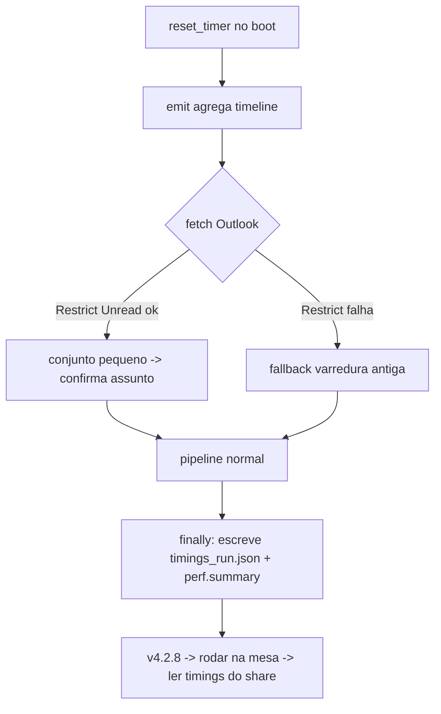

# Implementation Plan: Performance — Fase 1 (Instrumentação + Outlook)

**Contexto:** O programa leva até 15 min nas máquinas da mesa de crédito (caixa de e-mail grande e compartilhada). O fetch do Outlook varre a Inbox inteira via COM (O(N) round-trips) e não há medição por etapa para guiar otimizações. Esta fase instrumenta o tempo por etapa e elimina o gargalo nº1 do Outlook, embarcando ambos numa v4.2.8 para a próxima rodada na mesa comprovar o ganho e expor o resto.

**Tech Stack:** Python 3.x (core, Windows-only), pywin32 (Outlook MAPI/COM), xlwings (Excel), JSON Lines (protocolo stdout→Electron), pytest. Empacotamento PyInstaller; deploy via `publicar.ps1`.

---

## 0. Contexto a Carregar

> Leia TODOS os itens abaixo ANTES de iniciar a execucao. Leia a versao ATUAL no disco — nao confie em memoria.

**Docs de contexto (convencoes e regras):**
- [ ] `CLAUDE.md` / `AGENTS.md` — diretrizes do agente + governanca SemVer (bump obrigatorio, fonte unica `app/package.json`)
- [ ] `context/metaspec.md` → secoes STACK, REGRAS DE NEGOCIO CRITICAS (Protocolo JSON Lines, Invariante de ordem)
- [ ] `context/index.md` → secao "Arquivos Criticos" (Backend core)

**Codigo de referencia (padroes a seguir):**
- [ ] `backend/src/log_emitter.py` — contrato `emit()` (1 linha JSON, flush imediato, `ts` ISO-8601); padrao a estender SEM quebrar
- [ ] `backend/tests/test_log_emitter.py` — padrao de teste do emissor a imitar
- [ ] `backend/tests/test_gerentes_orfaos.py` — padrao de fakes COM (`_FakeEmail`, etc.) a imitar para mockar Outlook

**Arquivos a modificar (ler estado atual antes de alterar):**
- [ ] `backend/src/log_emitter.py` — timeline em memoria (tarefa 1.1)
- [ ] `backend/src/gerencie_carteira.py` — `buscar_emails_novos()` ~L252 (tarefa 2.1); `main()` ~L764 escreve timings (tarefa 1.2)
- [ ] `app/package.json` — bump 4.2.7 → 4.2.8 (tarefa 3.3)

---

## 1. Objetivos & Escopo

### 1.1. Objetivos

* **Goals:**
  1. Medir o tempo de cada etapa do pipeline e persistir um resumo por execucao (separar lancamento vs pipeline e achar o estagio dominante).
  2. Eliminar o gargalo O(N) do fetch do Outlook usando `Items.Restrict()` (filtro server-side), cortando o custo que escala com o tamanho da caixa.
  3. Embarcar 1+2 numa v4.2.8 verificavel na proxima rodada da mesa.

### 1.2. Escopo

* **Inputs:** Inbox do Outlook (MAPI, caixa grande/compartilhada); eventos `emit()` ja existentes com `ts`.
* **Outputs:** Arquivo `timings_<run>.json` em `pasta_logs` (no share) com timeline por etapa + total; evento `perf.summary`; mesma lista de e-mails filtrados de antes (contrato preservado).
* **In-Scope:** Instrumentar `emit`/pipeline; trocar a varredura da Inbox por `Restrict`; testes unitarios; bump de versao.
* **Out-of-Scope:** Nao implementar o launcher local (Fase 5, pendente de decisao). Nao alterar a logica de parsing HTML, Excel, PROCX ou escrita transacional. Nao mexer no `publicar.ps1`/build nesta fase.
* **Constraint:** O contrato JSON Lines deve permanecer intacto — `emit()` continua emitindo exatamente 1 linha JSON valida por chamada, com flush; nenhum `print()` solto.
* **Constraint:** A semantica de `buscar_emails_novos()` deve permanecer identica — retorna a MESMA lista de MailItems (nao lidos + assunto exato) que a varredura antiga retornaria; em caso de falha do `Restrict`, cair no comportamento antigo (sem perder e-mails).
* **Constraint:** A escrita do `timings_<run>.json` e best-effort — falha (share offline) nunca derruba o pipeline.

---

## 2. Design Tecnico

### Fluxo de Dados

1. **Boot:** `main()` chama `reset_timer()` (log_emitter) → marca `t0` monotonic.
2. **Cada etapa:** `emit(level, ..., step=...)` agrega `{step, t_ms, dt_ms}` numa timeline em memoria (t_ms = ms desde o boot; dt_ms = ms desde o emit anterior).
3. **Fetch Outlook (novo):** `inbox.Items.Restrict("[Unread] = true")` devolve apenas nao-lidos (conjunto pequeno, pois marcamos lido a cada run) → Python confirma `Subject == assunto` no conjunto reduzido.
4. **Fim:** `main()` (em `finally`) escreve `timings_<run>.json` em `pasta_logs` e emite `perf.summary` com total e top etapas.

### Estruturas de Dados (Draft)

```text
# log_emitter (modulo)
_t0: float | None          # monotonic do boot
_t_prev: float | None       # monotonic do emit anterior
_TIMELINE: list[dict]       # [{step, msg, t_ms, dt_ms}, ...]  (so quando step != None)

reset_timer() -> None        # zera _t0/_t_prev/_TIMELINE
get_timeline() -> list[dict] # copia da timeline
emit(...)                    # inalterado no contrato; passa a registrar timing quando step

# buscar_emails_novos (pseudocodigo)
items = inbox.Items
try:
    restrita = items.Restrict("[Unread] = true")   # filtro server-side
except Exception:
    restrita = items                                 # fallback: varredura antiga
filtrados = [m for m in restrita if _eh_alvo(m, assunto)]   # confirma assunto no conjunto pequeno
# _eh_alvo: try/except defensivo p/ itens nao-MailItem

# timings_<run>.json
{ "version": "...", "total_ms": 123456,
  "steps": [{"step": "outlook.fetch", "t_ms": 800, "dt_ms": 800}, ...] }
```

### Diagrama de Impacto (arquivos)

```text
Gerencie_Carteira/
├── backend/
│   ├── src/
│   │   ├── log_emitter.py            [MODIFY] timeline em memoria + reset/get
│   │   └── gerencie_carteira.py      [MODIFY] Restrict no fetch + dump de timings
│   └── tests/
│       ├── test_log_emitter_timing.py   [ADD] testes da timeline
│       └── test_outlook_fetch.py        [ADD] testes do Restrict/fallback
└── app/
    └── package.json                 [MODIFY] 4.2.7 → 4.2.8
```

### Cronograma (Gantt)

```mermaid
gantt
    dateFormat  X
    axisFormat %s
    section Instrumentacao
    1.1 timeline log_emitter      :a1, 0, 1
    1.2 dump timings em main()    :a2, after a1, 1
    section Outlook
    2.1 Restrict + fallback       :b1, after a1, 1
    section Testes & Release
    3.1 testes timing             :c1, after a2, 1
    3.2 testes fetch              :c2, after b1, 1
    3.3 bump + suite + commits    :c3, after c1, 1
```



### Visao de Execucao (Flowchart)



---

## 3. Execucao Faseada

### Fase 1: Instrumentacao de Tempo (Infrastructure)
- [ ] **1.1: Timeline em memoria no emissor** [MODIFY: ./backend/src/log_emitter.py]
    - Adicionar `_t0`/`_t_prev`/`_TIMELINE` (monotonic). `reset_timer()` zera tudo. `emit()` passa a registrar `{step, msg, t_ms, dt_ms}` na timeline QUANDO `step is not None` — sem alterar o JSON emitido em stdout (contrato intacto). `get_timeline()` retorna copia.
    - *Verificacao:* `emit` continua produzindo 1 linha JSON valida (test_log_emitter atual passa); `get_timeline()` reflete a ordem e os deltas.
- [ ] **1.2: Dump de timings ao fim do run** [MODIFY: ./backend/src/gerencie_carteira.py]
    - `main()`: `reset_timer()` logo apos o boot. Em `finally` (best-effort), escrever `timings_<run>.json` em `pasta_logs` e emitir `perf.summary` (total_ms + etapas). Falha de escrita = warning silencioso, nunca derruba o run.
    - *Verificacao:* Rodar localmente (modo dev redireciona p/ `<repo>\data`) gera `timings_*.json` legivel; pipeline conclui mesmo se a pasta de logs estiver indisponivel.

### Fase 2: Outlook Restrict (Core Domain)
- [ ] **2.1: Substituir varredura O(N) por Restrict** [MODIFY: ./backend/src/gerencie_carteira.py]
    - Em `buscar_emails_novos()`: `inbox.Items.Restrict("[Unread] = true")` dentro de try/except (fallback = varredura antiga). Confirmar `Subject == assunto` no conjunto reduzido, com guarda defensiva p/ itens nao-MailItem. Preservar o tipo/ordem do retorno. Emitir no evento `outlook.fetch` quantos itens o Restrict devolveu vs filtrados (visibilidade do ganho).
    - *Verificacao:* Com fake Outlook, `Restrict` e chamado e a iteracao NAO percorre o conjunto completo; retorno identico ao esperado; quando `Restrict` lanca, cai no fallback e ainda retorna os corretos.

### Fase 3: Testes & Release v4.2.8 (Testing)
- [ ] **3.1: Testes da timeline** [ADD: ./backend/tests/test_log_emitter_timing.py]
    - `reset_timer` + sequencia de `emit(step=...)` → `get_timeline()` ordenada, `dt_ms`/`t_ms` monotonicos; `emit` sem `step` nao polui a timeline; contrato JSON intacto.
    - *Verificacao:* `pytest` verde.
- [ ] **3.2: Testes do fetch** [ADD: ./backend/tests/test_outlook_fetch.py]
    - Fake namespace/inbox com `Items.Restrict` → caminho feliz (filtra por unread, confirma assunto), fallback (Restrict raise), e item nao-MailItem ignorado.
    - *Verificacao:* `pytest` verde; assert de que o full-scan nao roda no caminho feliz.
- [ ] **3.3: Bump + suite + commits** [MODIFY: ./app/package.json]
    - Bump 4.2.7 → 4.2.8. Rodar a suite inteira. Commits organizados (1 por fase logica), mensagens `perf(v4.2.8): ...`.
    - *Verificacao:* `pytest` (todas as suites) verde; `git log` com commits separados.

### Fase 4: (CONDICIONAL — apos medir) Recalculo & overheads (Cleanup)
> Gate: so executar apos a 1a rodada instrumentada na mesa confirmar que recalculo/sleeps pesam.
- [ ] **4.1: CalculateFullRebuild condicional** [MODIFY: ./backend/src/gerencie_carteira.py]
    - `recalcular_completo` (full rebuild) somente quando houve injecao de orfaos (mudanca estrutural); senao `app.calculate()` normal. Aparar `time.sleep(1)` fixos onde seguro; avaliar custo do `RefreshTable`.
    - *Verificacao:* Pivot continua correta com orfaos (regressao v4.2.7 coberta); timings mostram queda nos runs sem orfaos.

### Fase 5: (CONDICIONAL — pendente de decisao do usuario) Launcher local (Infrastructure)
> Gate: so executar se o usuario aprovar a abordagem de copia local.
- [ ] **5.1: Launcher copia-para-local com checagem de versao** [MODIFY: ./publicar.ps1]
    - `.cmd` (gerado pelo `publicar.ps1`) passa a: comparar marcador de versao local vs share → se difere, `robocopy` do app p/ `%LOCALAPPDATA%\Gerencie Carteira` → rodar o exe LOCAL. App segue publicado no share (publish inalterado). Nome do exe permanece neutro (ASAR integrity).
    - *Verificacao:* 1a execucao copia e roda; execucoes seguintes rodam local sem stream de rede; atualizar a versao no share forca recopias.

---

## 4. Estrategia de Testes

- [ ] **Unitarios:** timeline do `log_emitter` (ordem, deltas, contrato JSON intacto); `buscar_emails_novos` com fake Outlook (Restrict feliz, fallback, item nao-mail).
- [ ] **Integracao (manual/observacional):** rodar a v4.2.8 na mesa → coletar `timings_<run>.json` do share → comparar `outlook.fetch` antes/depois e obter o split lancamento-vs-pipeline.
- [ ] **Regressao:** suite pytest completa (59 testes atuais) permanece verde; regressao da pivot v4.2.7 intacta.

---

## 5. Rollback & Riscos

- **Risco:** Sintaxe/semantica do `Restrict` variar em caixa compartilhada/delegada (unread por-delegate).
    - *Mitigacao:* `try/except` com fallback para a varredura antiga + confirmacao de `Subject` em Python (resultado identico, so muda a velocidade). Emitir contagem para visibilidade.
- **Risco:** Itens nao-MailItem na Inbox quebrarem `.Subject` no conjunto restrito.
    - *Mitigacao:* guarda defensiva (`try/except`/checagem de Class) ao avaliar cada item.
- **Risco:** Escrita do `timings_<run>.json` falhar (share offline) e abortar o run.
    - *Mitigacao:* best-effort em `finally` com `try/except`; nunca propaga.
- **Risco:** Instrumentar `emit()` introduzir overhead ou efeito colateral no hot path.
    - *Mitigacao:* registro O(1) em lista na memoria; nenhuma I/O por evento (dump unico ao final).
- **Rollback:** Reverter os commits `perf(v4.2.8)` e rebaixar `app/package.json` para 4.2.7; republicar. Mudancas sao aditivas e isoladas (emissor + 1 funcao de fetch).
